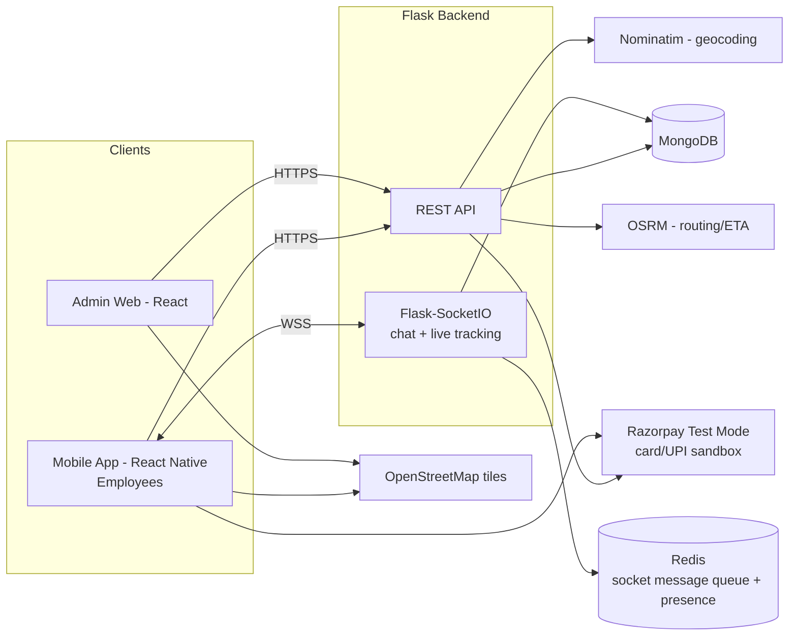
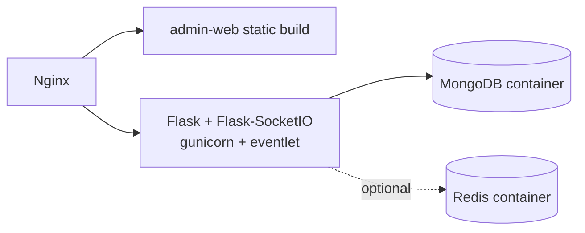

# Architecture

## Repo layout (proposed)

```
oodo-hackathon/
├── apps/
│   ├── mobile/          # React Native app (employee-facing, from wireframe screens)
│   └── admin-web/        # React admin dashboard (Employees / Vehicles / Settings tabs)
├── server/                # Flask API + Flask-SocketIO
│   ├── app/
│   │   ├── auth/
│   │   ├── rides/
│   │   ├── bookings/
│   │   ├── payments/
│   │   ├── wallet/
│   │   ├── vehicles/
│   │   ├── admin/
│   │   ├── chat/          # global channel + DMs + ride chat
│   │   └── tracking/       # live location / ETA
│   └── requirements.txt
└── docs/
```

## High-level diagram



## Why this stack

- **React / React Native** — one language across mobile and admin web, matches the
  wireframe's screen-based navigation (bottom nav: Dashboard, My Trips, Ride History,
  Vehicle, Settings).
- **Flask** — small, unopinionated, fast to build a REST API against in a hackathon
  timeframe; **Flask-SocketIO** adds WebSockets for chat and live trip tracking without
  a second framework.
- **MongoDB** — the domain is document-shaped (a ride embeds its own locations, a
  message belongs to one conversation); avoids schema migrations while the wireframe
  is still evolving.
- **Razorpay Test Mode** — the problem statement mandates a payment sandbox; Razorpay's
  test keys give a realistic card/UPI checkout with zero real-money risk. Wallet and
  cash flows stay fully internal.
- **Leaflet + OpenStreetMap** — free, no API key, sufficient for pickup/drop pins,
  route preview polylines, and live-trip marker updates. Nominatim gives address ↔
  lat/lng, OSRM gives route geometry + ETA (used by the "Coming in 5 Minutes" /
  Track Ride screen).
- **Redis** as the Socket.IO message queue — lets chat/tracking scale across more than
  one Flask worker process without dropping events (skip this in a single-worker
  hackathon deploy; add it when you actually run >1 worker).

## Auth & multi-tenancy

Every user and every domain document (ride, vehicle, conversation, ...) carries a
`company_id`. All queries are scoped by the authenticated user's `company_id` — this is
what keeps one company's employees, rides, and chat from ever being visible to another
company. Roles: `employee`, `admin` (per company). A user can simultaneously be a rider
and a driver.

## Deployment (hackathon-scale)



Single `docker-compose.yml` with `mongo`, `server`, and `admin-web` (nginx) services is
enough to demo the whole platform; the mobile app runs via Expo against the same API.
