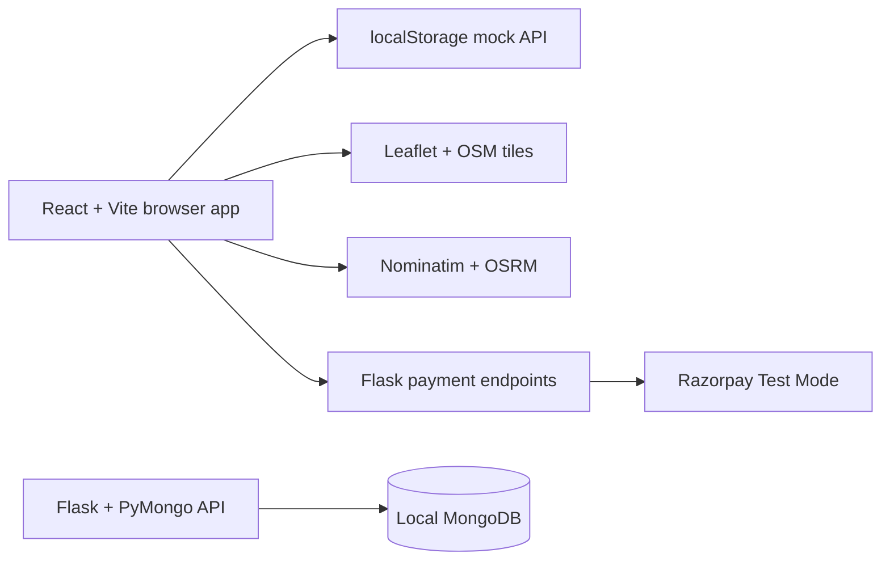

# Architecture

## Current prototype



The frontend is a single React application with route guards for employee,
organization-admin, and platform-super-admin areas. `src/api/api.js` keeps the
same async shape as the future HTTP API, while `src/api/db.js` persists demo
records in browser localStorage. This makes the whole UI runnable without a
database and keeps the eventual API swap mechanical.

The exception is payments: Razorpay order creation and verification call Flask
because the secret must never be exposed in the browser.

## Backend production path

The Flask backend contains the authoritative tenant, booking, report, and payment
contracts. Every tenant-owned record carries `company_id`; every request derives
the caller from authentication and scopes queries to that company. The backend
booking route uses a conditional atomic seat decrement and creates the booking in
the same transaction.

For a production deployment, point the frontend API layer at Flask, use Postgres
or the configured SQL database, add JWT/session rotation, and put the backend
behind HTTPS. Use WebSockets/SSE only for ride-chat and availability/tracking
events that need realtime delivery.

## Concurrency design

The authoritative operation is:

```sql
UPDATE rides
SET seats_available = seats_available - :requested
WHERE id = :ride_id
  AND status = 'active'
  AND seats_available >= :requested;
```

If the affected-row count is zero, return `409 Conflict`; otherwise insert the
booking and commit the transaction. Add a unique idempotency key per rider/request
to safely retry after network failure. For Razorpay flows, reserve seats with a
short expiry or release them when payment is abandoned, then confirm the booking
from the verified payment webhook.

## Maps and simulation

Leaflet renders the map and markers. Nominatim provides debounced address search
and reverse geocoding; OSRM supplies route geometry, distance, and ETA. Track Ride
uses that saved geometry for a visual marker playback. It intentionally does not
read browser GPS or mutate trip state when playback reaches the end.
