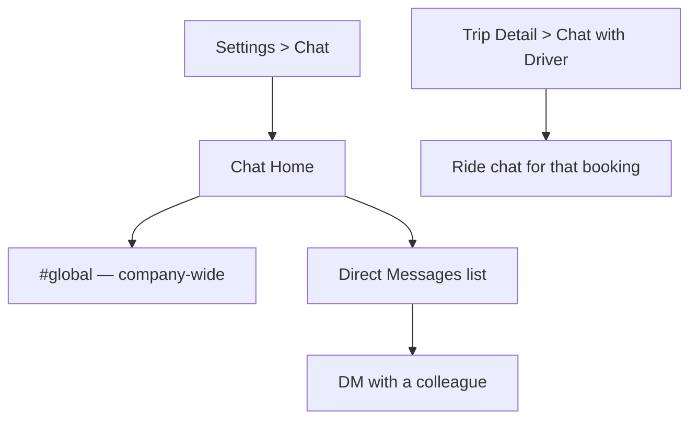
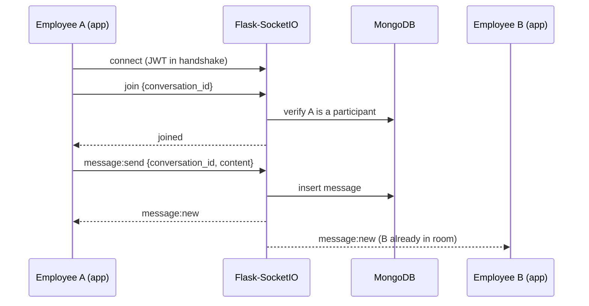

# Chat System (Discord-style employee chat)

The wireframe already reserves a **Chat** entry in the Settings menu and a
**"Chat with Driver"** button on the Trip Detail screen. This document specifies the
full chat system: one company-wide channel + employee-to-employee DMs (the new
Discord-like part), plus how it absorbs the existing ride chat so there's a single
messaging engine behind all three.

## Three conversation types, one engine

| Type | Members | Created | Lifetime |
|---|---|---|---|
| `global` | every employee in the company with `platform_access: granted` | lazily, on first access per company | permanent |
| `dm` | exactly 2 employees, any pairing within the company | lazily, on first message between them | permanent |
| `ride` | the rider(s) + driver of one booking | automatically when a booking is created | archived/read-only once the trip status becomes `completed` or `cancelled` |

All three are rows in the same `conversations` collection (see
[data-model.md](data-model.md#conversations-chat--see-chat-systemmd-for-full-design)) and
share the same `messages` collection, socket rooms, pagination, and read-receipt logic.
This is what keeps the implementation Discord-like — one core, three entry points —
rather than three separate features.

## Global channel

- One per `company_id`. Every employee is implicitly a member — no join/leave step,
  mirroring a Discord server's default `#general`.
- Anyone with `platform_access: granted` can post; anyone with access `revoked` by an
  admin loses read/write immediately (checked on socket `join` and on every
  `message:send`).
- No threads/reactions in v1 — flat, chronological, like the wireframe's simplicity
  elsewhere. Can be layered on later without a schema change (a `parent_message_id` and
  a `reactions` map would slot into the existing `messages` doc).

## Direct messages

- Find-or-create: `POST /chat/conversations/dm { user_id }` looks for an existing
  `type: "dm"` conversation with `participant_ids` containing exactly `[me, user_id]`
  (order-independent) before creating a new one — so repeatedly opening a DM with the
  same person never creates duplicates.
- Employees can DM anyone in the same `company_id`; cross-company DMs are rejected at
  the API layer (`company_id` mismatch → 403), same tenancy rule as everything else.
- Entry point in the app: a searchable employee directory (reuses the Admin
  "Employees" list data, filtered to the caller's own company) → tap a colleague →
  opens/creates the DM.

## Ride chat (existing wireframe feature, formalized)

- Created automatically alongside the `booking` document, with
  `participant_ids: [rider_id, driver_id]` and `ride_booking_id` set.
- Surfaced as the "Chat with Driver" button already drawn on the Trip Detail screen.
- Once the booking's status flips to `completed` or `cancelled`, the conversation is
  marked read-only (still visible from Ride History for reference, but `message:send`
  is rejected server-side).

## Realtime transport

Flask-SocketIO, one namespace `/chat`, one **room per `conversation_id`**.

- **Auth on connect**: JWT passed in the Socket.IO handshake `auth` payload, decoded
  once per connection; every subsequent `join`/`message:send` re-checks that the user
  is still a participant (and, for `global`, still has `platform_access: granted`) —
  this is what makes an admin's "Revoke" action take effect immediately without the
  client reconnecting.
- **Rooms**: joining a conversation = `socketio.join_room(conversation_id)`. The
  client joins the global room and every DM/ride room it has open on app start (from
  `GET /chat/conversations`), so messages arrive live without a per-screen re-join.
- **Fan-out**: `message:new` is emitted only to the room, so no client ever receives a
  message for a conversation it isn't in.
- **Scaling**: with more than one Flask worker, set Flask-SocketIO's `message_queue` to
  a Redis URL so rooms/events are shared across workers. Not needed for a single-process
  hackathon deploy.
- **REST fallback** (`POST /chat/.../messages`) exists for reliability (retry after a
  dropped socket) and is the same code path the socket handler calls internally, so a
  message is written to Mongo exactly once either way.

## Unread state & read receipts

- Each `message` has `read_by: [user_id]`. A conversation is "unread" for a user if the
  latest message's `_id` isn't in that user's read set.
- `POST /chat/conversations/:id/read` (called when the chat screen is opened / on
  scroll-to-bottom) appends the caller to `read_by` for all messages up to the given id
  in one bulk update.
- The Chat Home screen and the bottom-nav "Chat" icon both derive their unread badge
  from `GET /chat/conversations`, which returns each conversation's
  `last_message_at` plus an `unread: bool` computed the same way.

## What's deliberately out of scope for v1

- Group DMs beyond 1:1 (a `dm` conversation is always exactly 2 participants) —
  Discord-style multi-person DMs can reuse the `ride`-style `participant_ids: [...]`
  shape later without a migration.
- Message editing/deletion, reactions, threads, @mentions, push notifications — noted
  in-line above as additive, non-breaking extensions to the same schema.
- Profanity/spam moderation on the global channel — the only moderation lever in v1 is
  an admin revoking `platform_access`, which already exists on the Employees tab.
