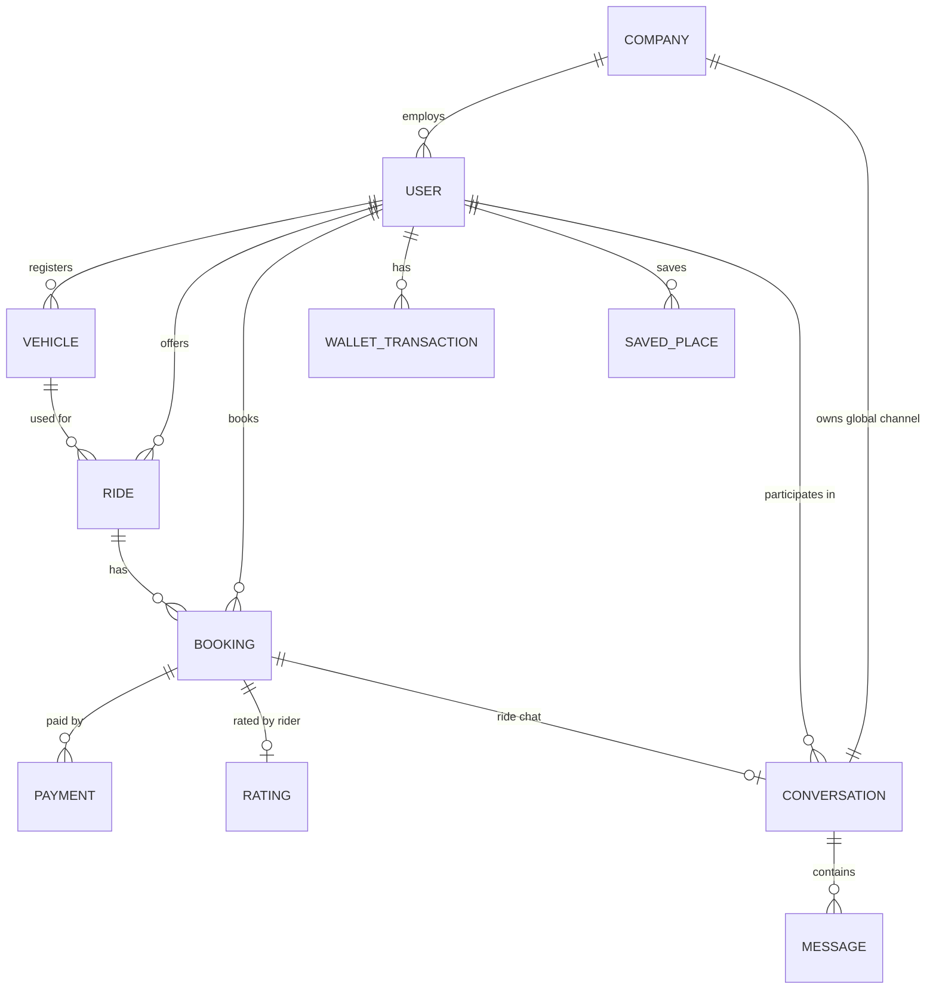

# Data Model (MongoDB)

MongoDB is schema-less; the shapes below are the *convention* the API enforces at the
application layer. All `_id`s are `ObjectId`. Timestamps are UTC.

## ER overview



## `companies`

```jsonc
{
  "_id": ObjectId,
  "name": "Odoo Pvt. Ltd.",
  "industry": "Software",
  "registered_address": "Gandhinagar",
  "admin_contact": "admin@odoo.com",
  "carpool_config": {
    "fuel_cost_per_liter": 96.50,
    "cost_per_km": 8.00,
    "travel_cost_operational_per_km": 2.50
  },
  "created_at": ISODate
}
```

## `users`

Covers employees, drivers, and admins — role is a field, not a separate collection,
since any employee can both offer and book rides.

```jsonc
{
  "_id": ObjectId,
  "company_id": ObjectId,
  "name": "Raj Patel",
  "email": "raj.patel@co.com",
  "phone": "+91...",
  "password_hash": "...",
  "department": "Engineering",
  "manager": "A. Shah",
  "location": "Ahmedabad",
  "role": "employee",              // "employee" | "admin"
  "platform_access": "granted",    // "granted" | "revoked"  (Admin > Employees tab)
  "profile_photo_url": "...",
  "rating_avg": 4.8,               // BlaBlaCar-style driver rating (bonus feature)
  "rating_count": 12,
  "wallet_balance": 500.0,
  "created_at": ISODate
}
```

## `vehicles`

```jsonc
{
  "_id": ObjectId,
  "company_id": ObjectId,
  "owner_id": ObjectId,          // -> users._id
  "registration_number": "GJ01AB1234",
  "model": "Swift Dzire",
  "seating_capacity": 4,
  "status": "active",            // "active" | "inactive"
  "created_at": ISODate
}
```

## `rides` (a published "Offer Ride")

```jsonc
{
  "_id": ObjectId,
  "company_id": ObjectId,
  "driver_id": ObjectId,
  "vehicle_id": ObjectId,
  "start_location": { "address": "Iskcon", "lat": 23.027, "lng": 72.507 },
  "destination_location": { "address": "Infocity", "lat": 23.180, "lng": 72.638 },
  "departure_at": ISODate,
  "recurring_days": ["Mo", "Tu", "We", "Th", "Fr"],   // empty = one-off
  "seats_total": 4,
  "seats_available": 2,
  "price_per_seat": 120,           // per-seat fare, BlaBlaCar model
  "route_polyline": "...",        // OSRM-encoded geometry, cached at publish time
  "distance_km": 21.4,             // from OSRM — feeds distance/fuel reports
  "status": "active",             // "active" | "started" | "completed" | "cancelled"
  "created_at": ISODate
}
```

One ride carries **one driver and one or more passengers** (each passenger is a
separate `booking` row); `seats_available` decrements per seat booked.

## `bookings` (a "Find Ride" → "Book Now"; drives My Trips / Ride History)

```jsonc
{
  "_id": ObjectId,
  "ride_id": ObjectId,
  "rider_id": ObjectId,
  "seats_booked": 1,
  "pickup_point": { "address": "Iskcon", "lat": 23.027, "lng": 72.507 },
  "drop_point": { "address": "Infocity", "lat": 23.180, "lng": 72.638 },
  "fare": 120,
  // Trip lifecycle straight from the problem statement (§5.4):
  "status": "booked",             // booked | started | in_progress | completed
                                   //   | payment_pending | payment_completed | cancelled
  "conversation_id": ObjectId,    // ride chat, see chat-system.md
  "created_at": ISODate
}
```

## `payments`

```jsonc
{
  "_id": ObjectId,
  "booking_id": ObjectId,
  "user_id": ObjectId,
  "amount": 120,
  "method": "wallet",             // cash | card | upi | wallet
  "status": "success",
  "razorpay_order_id": "order_...",   // card/UPI via Razorpay Test Mode (sandbox only)
  "razorpay_payment_id": "pay_...",
  "transaction_ref": "...",
  "created_at": ISODate
}
```

## `wallet_transactions`

```jsonc
{
  "_id": ObjectId,
  "user_id": ObjectId,
  "type": "credit",                // credit | debit
  "amount": 500,
  "balance_after": 500,
  "reference": "recharge | booking_fare | ...",
  "created_at": ISODate
}
```

## `saved_places` (Settings > Saved Places, problem statement §5.10)

Frequently used pickup/destination locations (Home, Office, ...) that prefill the
Find Ride / Offer Ride forms.

```jsonc
{
  "_id": ObjectId,
  "user_id": ObjectId,
  "label": "Office",               // Home | Office | custom
  "address": "Infocity, Gandhinagar",
  "lat": 23.180,
  "lng": 72.638,
  "created_at": ISODate
}
```

## `ratings` (bonus, BlaBlaCar-style)

One per completed booking; keeps `users.rating_avg`/`rating_count` denormalized for
cheap display on Available Rides cards.

```jsonc
{
  "_id": ObjectId,
  "booking_id": ObjectId,
  "rater_id": ObjectId,            // the passenger
  "ratee_id": ObjectId,            // the driver
  "stars": 5,                       // 1–5
  "comment": "...",
  "created_at": ISODate
}
```

## `location_pings` (live trip tracking)

Written by the driver's app every few seconds **only while a trip is active**
(problem statement: live location sharing is enabled only during an active trip).
Latest ping per ride also cached in memory for the Track Ride screen; the collection
gives distance-travelled data for reports. TTL-index old pings after ~7 days.

```jsonc
{
  "_id": ObjectId,
  "ride_id": ObjectId,
  "lat": 23.10, "lng": 72.55,
  "speed_kmh": 42,
  "recorded_at": ISODate
}
```

## `conversations` (chat — see [chat-system.md](chat-system.md) for full design)

```jsonc
{
  "_id": ObjectId,
  "company_id": ObjectId,
  "type": "global",                // "global" | "dm" | "ride"
  "participant_ids": [ObjectId, ObjectId],  // all employees for "global"; 2 users for "dm"; rider+driver for "ride"
  "ride_booking_id": ObjectId,      // only set when type == "ride"
  "last_message_at": ISODate,
  "created_at": ISODate
}
```

## `messages`

```jsonc
{
  "_id": ObjectId,
  "conversation_id": ObjectId,
  "sender_id": ObjectId,
  "content": "text...",
  "attachment_url": null,
  "read_by": [ObjectId],
  "created_at": ISODate
}
```

## Indexes worth creating

- `users`: `{ company_id: 1, email: 1 }` unique
- `vehicles`: `{ company_id: 1, registration_number: 1 }` unique
- `rides`: `{ company_id: 1, status: 1, departure_at: 1 }`, plus a `2dsphere` index on
  `start_location`/`destination_location` if you do proximity search later
- `bookings`: `{ rider_id: 1, status: 1 }`
- `saved_places`: `{ user_id: 1 }`
- `location_pings`: `{ ride_id: 1, recorded_at: -1 }` + TTL index on `recorded_at`
- `conversations`: `{ company_id: 1, type: 1 }`, `{ participant_ids: 1 }`
- `messages`: `{ conversation_id: 1, created_at: -1 }` (paginating chat history)
