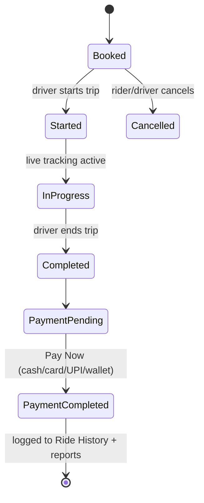

# Screens & Flows

Every screen below comes from the wireframe; each is mapped to its purpose and the API
it's backed by. Chat screens (marked **new**) extend the wireframe's existing
"Settings > Chat" and "Chat with Driver" entries per [chat-system.md](chat-system.md).

## Employee app

| Screen | Purpose | Backed by |
|---|---|---|
| Splash Screen | Platform branding on launch | — |
| Welcome / Login | Email or mobile + password | `POST /auth/login` |
| Create Account / Sign Up | Photo, name, phone, email, password | `POST /auth/signup` |
| Dashboard | Entry point to Offer Ride / Find Ride | `GET /users/me` |
| Offer Ride | Start/destination, swap, date & time, seats → Publish Ride | `POST /rides`, route preview via `GET /rides/route-preview` |
| Find Ride | Start/destination (prefillable from Saved Places), date & time, seats, recurring-ride toggle → search | `GET /rides/search` |
| Route Confirmation | Preview calculated route on map, Confirm | `GET /rides/route-preview` (Leaflet + OSRM) |
| Available Rides | Ride cards BlaBlaCar-style: driver name + rating, route, departure, ₹/seat, seats left; Book Now (instant booking), Refresh | `GET /rides/search`, `POST /bookings` |
| My Trips — Trip Detail | Driver, vehicle, pickup/drop, "Chat with Driver", Call | `GET /bookings/:id` |
| Track Ride | Live map, ETA ("Coming in 5 Minutes") | `GET /bookings/:id/track` + socket `location:update` |
| Trip Finish | Fare summary, Pay Now | `PATCH /bookings/:id/status`, `GET /payments/:booking_id` |
| Payment Method | Cash / Card / UPI / Wallet | `POST /payments/charge` |
| Wallet | Balance, Recharge Wallet | `GET /wallet`, `POST /wallet/recharge` |
| Ride History | Past trips with driver, vehicle, date/time | `GET /bookings/history` |
| My Vehicle | Registered vehicles, Add Vehicle | `GET /vehicles`, `POST /vehicles` |
| Saved Places | Save Home/Office/custom locations; used to prefill Find Ride and Offer Ride forms | `GET/POST/DELETE /saved-places` |
| Settings | Profile, My Trips, My Vehicle, Payment Method, Ride History, Saved Places, Help, **Chat** | see below |
| Report (driver) | Fuel cost, fleet ROI, utilization, monthly financial summary | `GET /admin/reports` (driver-scoped subset) |

## Chat screens (new)

| Screen | Purpose | Backed by |
|---|---|---|
| Chat Home (from Settings > Chat) | Tabs/sections for the global channel and DMs, unread badges | `GET /chat/conversations` |
| #Global channel | Company-wide feed, everyone can post | `GET /chat/conversations/global`, socket room `global:<company_id>` |
| Employee directory / DM picker | Search colleagues to start a DM | `GET /admin/employees` (read-only for this use) |
| DM conversation | 1:1 chat, typing indicator, read receipts | `GET /chat/conversations/:id/messages`, socket `message:send`/`message:new` |
| Ride chat ("Chat with Driver") | Rider ↔ driver for one trip, auto-closed after trip ends | same engine, `type: "ride"` |

## Admin dashboard

| Screen | Purpose | Backed by |
|---|---|---|
| Employees tab | List (name, email, department, manager, location), Platform Access, + Add Employee | `GET /admin/employees`, `POST /admin/employees`, `PATCH /admin/employees/:id/access` |
| Vehicles tab | List (reg. no., model, driver, status), + Add Vehicle | `GET /admin/vehicles`, `PATCH /admin/vehicles/:id/status` |
| Settings tab | Company details, carpool configuration (fuel cost/L, cost/km, travel cost), Save Settings | `GET /admin/settings`, `PUT /admin/settings` |
| Dashboard header stats | Total Employees, Registered Vehicles, Rides This Month | `GET /admin/reports` |

## Key user flows

**Publish and get booked (driver side)**
Dashboard → Offer Ride → fill start/dest/date/seats → Route Confirmation → Confirm →
Publish Ride → ride appears in another employee's Find Ride results.

**Find and book (rider side)**
Dashboard → Find Ride → fill start/dest/date/seats → Available Rides → Book Now →
booking created → My Trips → Trip Detail (chat/call driver available) → Track Ride →
Trip Finish → Pay Now → Payment Method → Ride History → (optional) rate the driver.

**Trip lifecycle (problem statement §5.4)**

Live location sharing (socket `/tracking`) runs only from Started to Completed.

**Chat, independent of any ride (new)**
Settings → Chat → either open **#global** (posts to the whole company instantly) or
pick a colleague from the directory to open/create a **DM** — both use the same
message list UI and the same socket connection already open for ride tracking/chat.

**Admin onboarding an employee**
Admin Dashboard → Employees → + Add Employee → employee gets `platform_access: granted`
→ employee can now log in, appear in the chat directory, and be found by colleagues
searching to start a DM (access revoke removes them from all of the above immediately).
