# Screens and flows

## Public/auth screens

| Screen | Purpose |
|---|---|
| Landing | Explains the private company-network value proposition and offers one primary login path plus employee join and organization registration |
| Login | Employee, organization-admin, and super-admin role selection; demo accounts are available from one dropdown |
| Employee sign up | Join an existing organization using its join code; account waits for admin approval |
| Organization registration | Create a company, its join code, and the first admin account |

## Employee screens

| Screen | Purpose |
|---|---|
| Dashboard | Find Ride, Offer Ride, wallet, upcoming trips, and offered rides |
| Find Ride | Select locations, date/time, seats, route, and view matching rides and nearby driver markers |
| Offer Ride | Select route, date/time, vehicle, seats, and per-seat fare; confirm route before publishing |
| My Trips | Passenger bookings and offered rides; driver approval, start, complete, and replay controls |
| Trip Detail | Vehicle, pickup/drop, fare, ride-scoped chat/call, cancel or reject pending booking |
| Track Ride | Leaflet route with a visual moving marker; replay/reset only |
| Payment | Razorpay Test Mode, wallet, or cash after the trip is manually completed |
| Ride History | Completed/cancelled trip records |
| My Vehicle | Add/edit/remove personal vehicles and declare passenger capacity and mileage |
| Saved Places | Home, Office, or custom map-picked places used as form shortcuts |
| Wallet / Settings | Balance, profile, and preferences |

## Organization-admin screens

Overview analytics, employee access management, vehicle management, and company
settings. Employee work address selection uses the assigned company workplace;
there is no branch-management screen.

## Platform super-admin screens

Overview operations console and Organizations management. The super admin can
inspect platform totals, review operational queues, suspend/restore a tenant, and
rotate a join code.

## Main demo flow

```mermaid
flowchart LR
  Login --> Find[Find Ride]
  Find --> Preview[Route preview]
  Preview --> Results[Available rides]
  Results --> Book[Book seats]
  Book --> Approve[Driver approves]
  Approve --> Track[Visual simulation]
  Track --> Start[Driver starts manually]
  Start --> Complete[Driver completes manually]
  Complete --> Pay[Payment]
  Pay --> History[Ride history]
```

